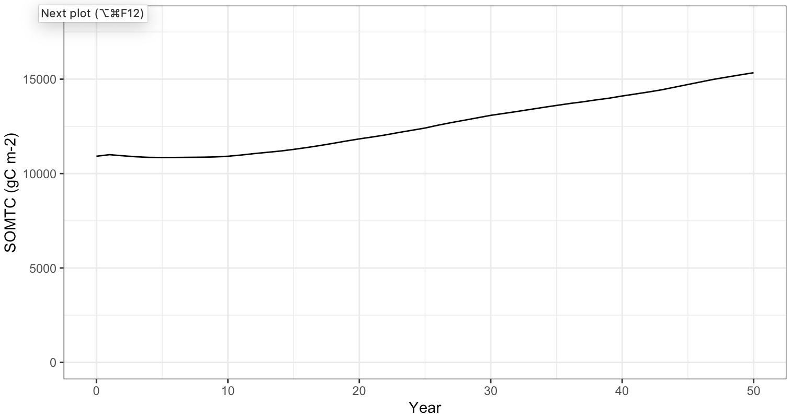
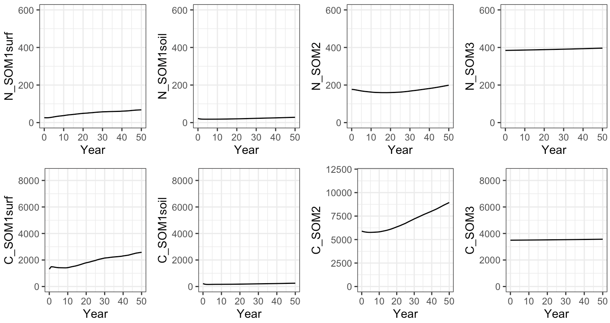
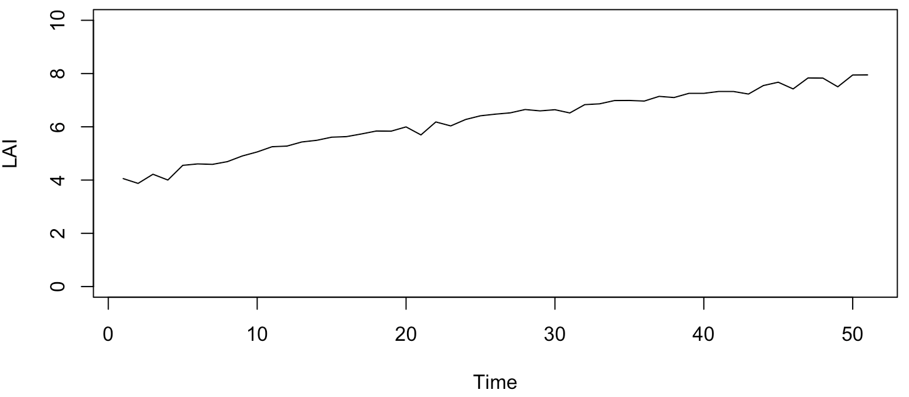
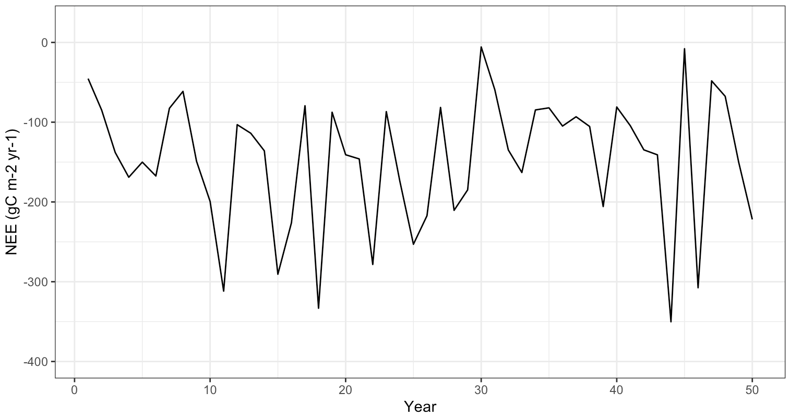
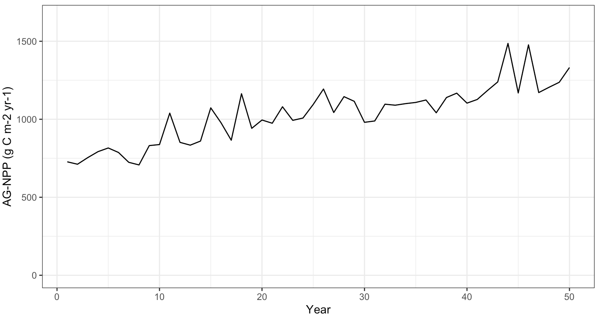
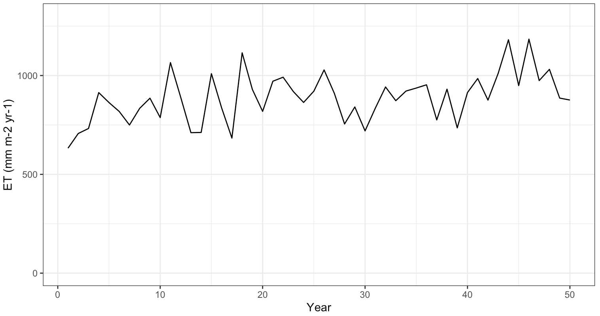
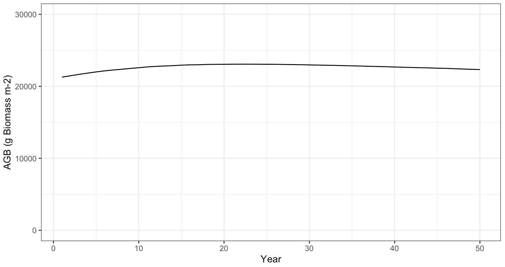

### Updated LANDIS-II NECN watershed model diagnostics ###

We set up the updated model to run at Coweeta watersheds 14 and 18. To check model behavior, we ran the model for 50 years using average climate. 

- Growth of the SOM pools as a fraction over 50 years 
    - SOMTC: 0.41 
    - SOM1 Surface: 0.97
    - SOM1 Soil: 0.14 
    - SOM2: 0.51
    - SOM3: 0.02

- The average mineral N is 4.0 g N m-2. 
- The average nitrogen deposition is 0.9 g N m-2 yr-1
    - (Boggs, McNulty, Gavazzi, & Myers, 2005) found N deposition ranged from 0.8 - 1.6 g N m-2 yr-1  
- The average nitrogen volatilization is 0.13 g N m-2 yr-1 
    - This is within the recommended range specified in the NECN user manual, which is  0 - 0.3 for uplands.

- The average LAI is 6.2. 
    - (Bolstad, Vose, & McNulty, 2001) found LAI between 2.7 and 8.2 with a median of 5.8 m2. 

- The average NEE is -147 g C m-2 yr-1.
    - (Oishi et al., 2018) found using the flux tower at Coweeta from 2011 - 2015 that the average NEE is -244 gC m-2 yr-1 

- The average modeled NPP is 1030 g C/ m2/ yr.
    - (Bolstad et al., 2001) found ANPP between 5.2 - 11.8 with an average of 9.2 based on 16 sites at Coweeta 

- The average ET is 887 mm yr-1.
    - Streamflow and precipitation from WS14 and WS18 were used to calculate ET as P-Q using a vegetation year from May - June. The average ET from 2011 - 2020 was 1016 mm yr-1. (Oishi et al., 2018) found using the flux tower at Coweeta from 2011 - 2015 that average ET was 856 mm yr-1. Our model estiamte falls within this range. 

- The average AGB is 22,659 g biomass.

Boggs, J. L., McNulty, S. G., Gavazzi, M. J., & Myers, J. M. (2005). Tree growth, foliar chemistry, and nitrogen cycling across a nitrogen deposition gradient in southern appalachian deciduous forests. Canadian Journal of Forest Research, 35(8), 1901-1913. doi:10.1139/x05-128

Bolstad, P. V., Vose, J. M., & McNulty, S. G. (2001). Forest productivity, leaf area, and terrain in southern appalachian deciduous forests. Forest Science, 47, 419-427. 

Oishi, A. C., Miniat, C. F., Novick, K. A., Brantley, S. T., Vose, J. M., & Walker, J. T. (2018). Warmer temperatures reduce net carbon uptake, but do not affect water use, in a mature southern appalachian forest. Agricultural and Forest Meteorology, 252, 269-282. doi:10.1016/j.agrformet.2018.01.011

